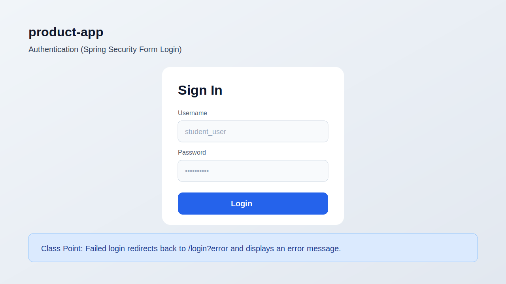
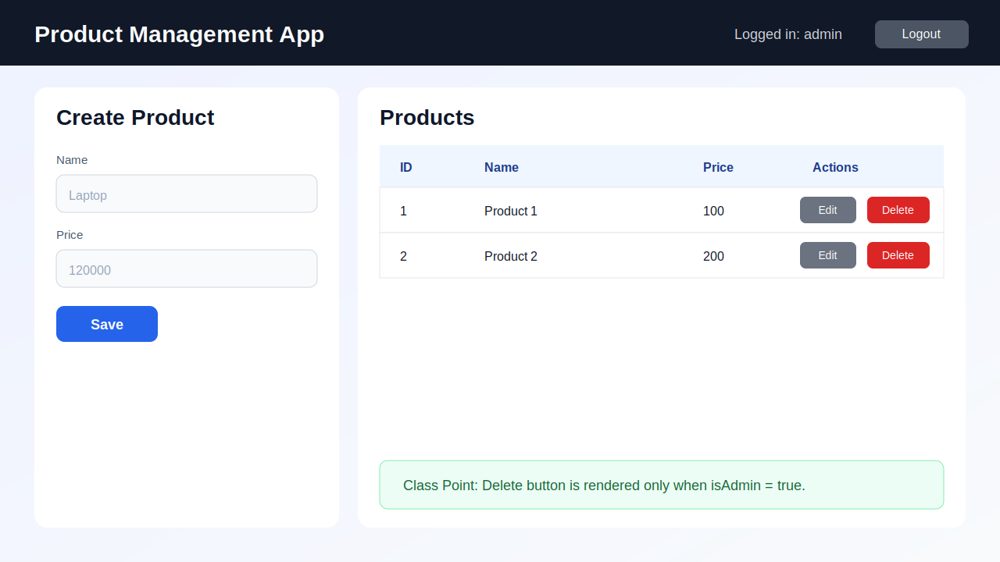
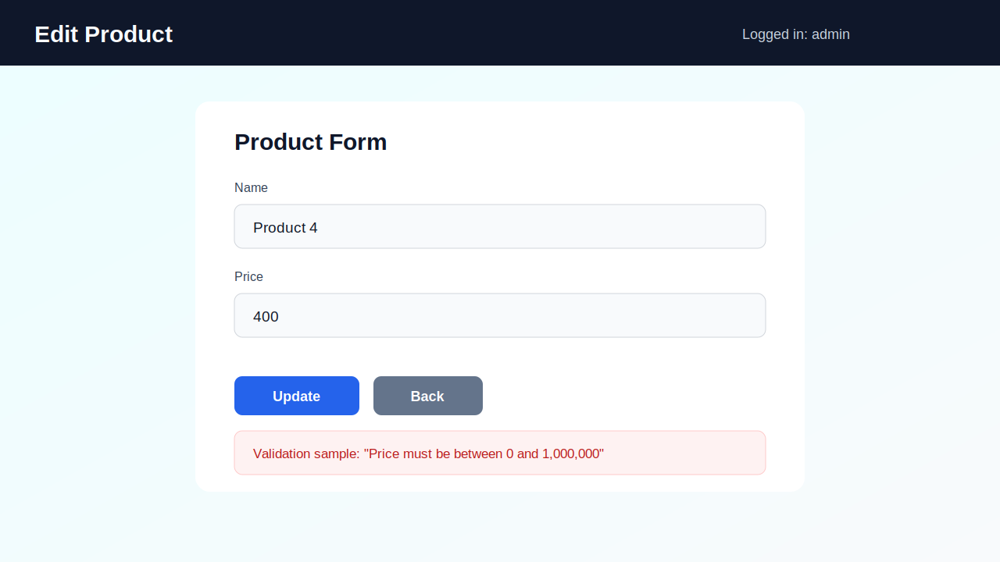
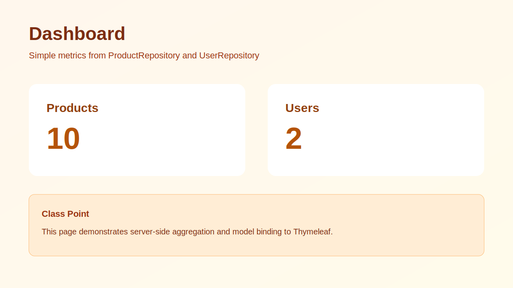
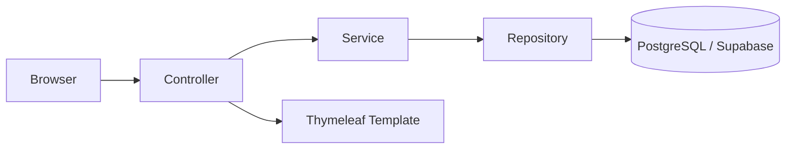

# product-app

<p align="left">
  
  
  
  
  
</p>

Spring Boot + Thymeleaf + PostgreSQL(Supabase) で構築した、授業向けの **商品管理Webアプリ** です。  
フォーム入力、バリデーション、認証・認可、ロール制御、DB永続化までを一通り学べる構成になっています。

> [!IMPORTANT]
> このREADMEは授業資料向けに、学習目標・画面説明・演習手順を含む「スクリーンショット付き版」です。

## 目次

- [プロジェクト概要](#プロジェクト概要)
- [学習目標](#学習目標)
- [スクリーンショット](#スクリーンショット)
- [機能と権限制御](#機能と権限制御)
- [アーキテクチャ](#アーキテクチャ)
- [実行環境とセットアップ](#実行環境とセットアップ)
- [授業での進め方（演習フロー）](#授業での進め方演習フロー)
- [ルーティング一覧](#ルーティング一覧)
- [ディレクトリ構成](#ディレクトリ構成)
- [トラブルシュート](#トラブルシュート)

## プロジェクト概要

`product-app` は以下を実践するための教育用プロジェクトです。

- Spring MVC（Controller + Thymeleaf）
- Spring Data JPA（Entity/Repository/Service）
- Bean Validation（入力チェック）
- Spring Security（ログイン認証・ロール認可）
- Supabase PostgreSQL 連携（環境変数による接続）

## 学習目標

このアプリを通して、次の到達目標を設定できます。

1. **MVCの責務分離**を説明できる
2. **フォームバリデーション**とエラー表示を実装できる
3. **JPAでCRUD**を実装できる
4. **認証（login/logout）と認可（ADMINのみ削除）**を区別して実装できる
5. **外部DB接続を環境変数で安全に管理**できる

## スクリーンショット

### 1. ログイン画面（`/login`）



- 学習ポイント: フォームログインとエラー表示（`/login?error`）

### 2. 商品一覧 + 商品登録画面（`/`）



- 学習ポイント: 一覧表示、登録フォーム、`isAdmin` による削除ボタン表示制御

### 3. 商品編集画面（`/products/{id}/edit`）



- 学習ポイント: 既存データの編集、バリデーション再表示

### 4. ダッシュボード（`/dashboard`）



- 学習ポイント: Repository集計値をModelに詰めてビュー表示

## 機能と権限制御

| 分類 | 内容 | 補足 |
|---|---|---|
| 認証 | ログイン/ログアウト | Spring Securityのフォームログイン |
| 商品登録 | `/add` (POST) | `@Valid` で入力検証 |
| 商品編集 | `/products/{id}/edit`, `/products/{id}/update` | 編集フォーム + 更新 |
| 商品削除 | `/delete` (POST) | `ADMIN` のみ許可 |
| ダッシュボード | `/dashboard` | 商品数・ユーザー数を表示 |

> [!TIP]
> `SecurityConfig` では `POST /delete` のみ `hasRole("ADMIN")` を要求し、その他はログイン済みユーザーに許可しています。

## アーキテクチャ



<details>
<summary>クラス責務の要点</summary>

- `controller/`: 画面遷移と入力受付
- `service/`: 業務処理
- `repository/`: DBアクセス
- `entity/`: テーブル対応モデル
- `form/`: 画面入力のバリデーション
- `security/`: 認証・認可設定

</details>

## 実行環境とセットアップ

### 前提

- JDK 17
- Maven Wrapper（`./mvnw`）
- Supabase（PostgreSQL）プロジェクト

### 1. 環境変数を設定

```bash
export SUPABASE_JDBC_URL='jdbc:postgresql://<HOST>:5432/postgres?sslmode=require'
export SUPABASE_DB_USER='<DB_USER>'
export SUPABASE_DB_PASSWORD='<DB_PASSWORD>'
```

### 2. テーブルを作成（例）

```sql
create table if not exists products (
  id serial primary key,
  name varchar(100) not null,
  price integer not null check (price between 0 and 1000000)
);

create table if not exists users (
  id serial primary key,
  username varchar(50) not null unique,
  password_hash varchar(255) not null,
  role varchar(20) not null check (role in ('ADMIN', 'USER'))
);
```

### 3. ユーザーを登録（例）

```sql
-- password_hash には BCrypt 文字列を保存してください
insert into users (username, password_hash, role)
values
  ('admin', '<BCrypt_HASH>', 'ADMIN'),
  ('student', '<BCrypt_HASH>', 'USER');
```

### 4. アプリ起動

```bash
./mvnw -q spring-boot:run
```

起動後に以下へアクセス:

- `http://localhost:8080/login`
- `http://localhost:8080/`
- `http://localhost:8080/dashboard`

## 授業での進め方（演習フロー）

- [ ] 1. ログイン成功/失敗の挙動を確認する
- [ ] 2. 商品登録でバリデーションエラーを再現する
- [ ] 3. 商品編集で更新処理を追う（Controller -> Service -> Repository）
- [ ] 4. `USER` と `ADMIN` で削除ボタン表示の差を確認する
- [ ] 5. `SecurityConfig` を読み、URLごとのアクセス制御を説明する
- [ ] 6. `DataSeeder` により初期データが自動投入される流れを確認する

## ルーティング一覧

| Method | Path | 認可 | 説明 |
|---|---|---|---|
| GET | `/login` | 誰でも可 | ログイン画面表示 |
| POST | `/login` | 誰でも可 | ログイン実行 |
| POST | `/logout` | ログイン済み | ログアウト |
| GET | `/` | ログイン必須 | 商品一覧 + 登録フォーム |
| POST | `/add` | ログイン必須 | 商品登録 |
| GET | `/products/{id}/edit` | ログイン必須 | 編集画面 |
| POST | `/products/{id}/update` | ログイン必須 | 商品更新 |
| POST | `/delete` | `ADMIN` のみ | 商品削除 |
| GET | `/dashboard` | ログイン必須 | ダッシュボード |

## ディレクトリ構成

```text
src/main/java/com/example/demo
├── config
├── controller
├── entity
├── form
├── repository
├── security
└── service

src/main/resources
├── static/css
├── templates
│   ├── login.html
│   ├── index.html
│   ├── edit.html
│   └── dashboard.html
└── application.properties

docs/images
├── screen-login.svg
├── screen-index.svg
├── screen-edit.svg
└── screen-dashboard.svg
```

## トラブルシュート

<details>
<summary>起動時にDB接続エラーになる</summary>

- `SUPABASE_JDBC_URL` / `SUPABASE_DB_USER` / `SUPABASE_DB_PASSWORD` の値を確認
- Supabase側で接続元制限や接続数上限を確認
- JDBC URL に `sslmode=require` が必要か確認

</details>

<details>
<summary>ログインできない</summary>

- `users.password_hash` が BCrypt 形式か確認
- `users.role` が `ADMIN` または `USER` になっているか確認
- `username` の重複やスペルを確認

</details>

---

授業利用時は、READMEを配布資料としてそのまま使用し、各セクションを実機確認とセットで進める構成を推奨します。
